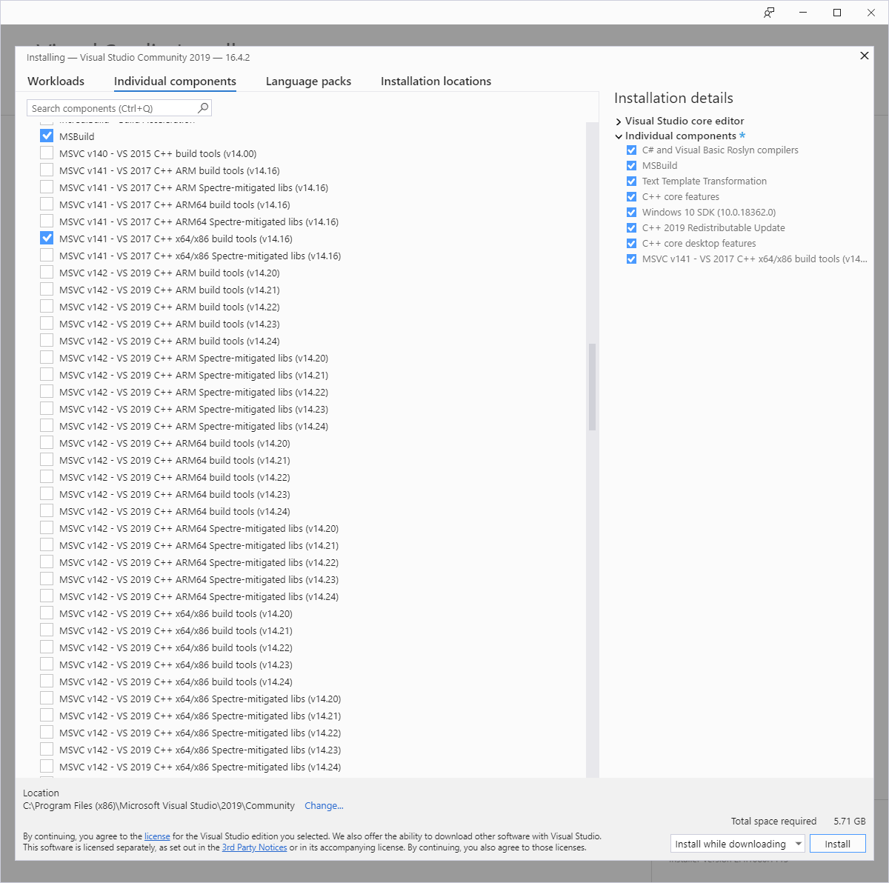
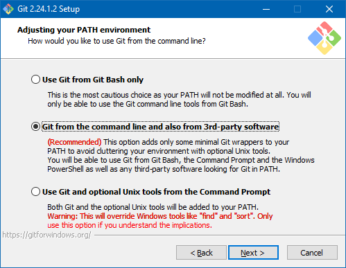
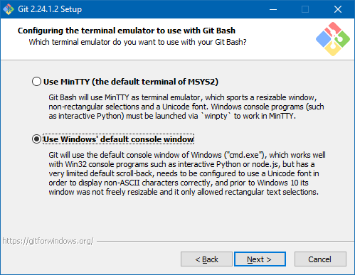
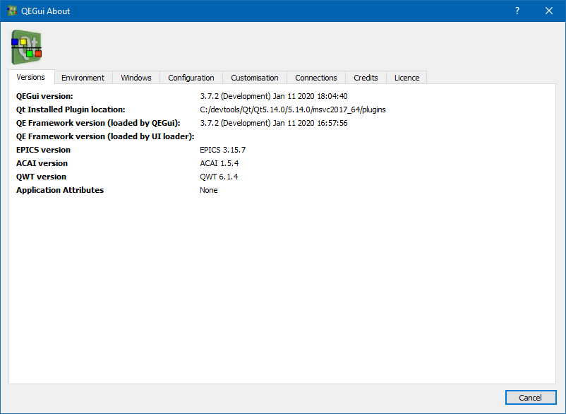
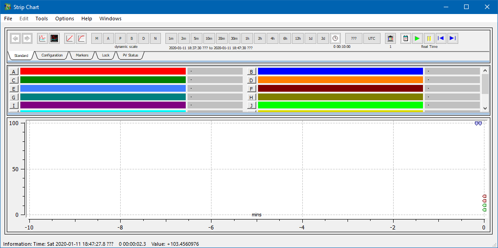
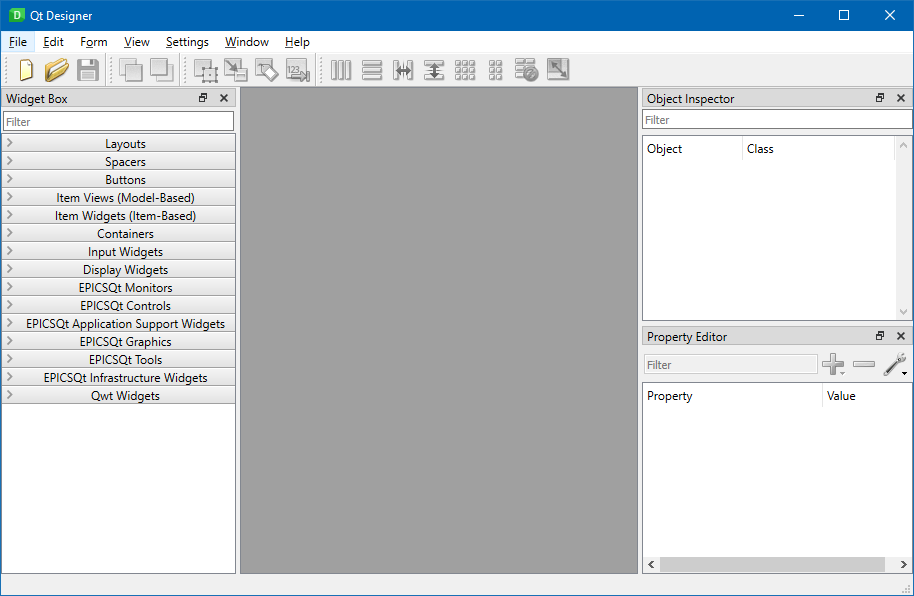
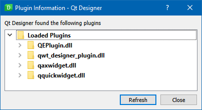

# <span style='color:#006666'>Building EPICS base, QE Framework and qegui on Windows 10 x64 with Qt 5.14 and MSVC2017</span>

[Environment](#environment)<br>
[EPICS base](#epicsBase)<br>
[ACAI](#ACAI)<br>
[Qwt](#Qwt)<br>
[EPICS Qt](#EpicsQt)<br>

# <a name="environment"></a><span style='color:#006666'>Environment</span>

* These instructions have been developed on Microsoft Windows 10 Enterprise x64 and Windows 10 Education x64. Should work on other versions of Windows 10, Windows 8 and Windows 7. You will have to make the appropriate adjustments if you want a 32-bit build.

## Tools

### Microsoft Visual Studio
* Obtain the [Microsoft Visual Studio Community 2019](https://visualstudio.microsoft.com/downloads/), installer.
* Choose the following options:
  * MSVC v141 - VS 2017 C++ x64/x86 build tools (v14.16)
  * Windows 10 SDK
* I chose to install to `c:\devtools\Visual Studio\2019` rather than `Program Files`
* We are choosing the MSCV 2017 tools rather than the MSVC 2019 tools, as Qt is built using MSVC 2017

* Check the versions:

```
Microsoft Windows [Version 10.0.18363.535]
(c) 2019 Microsoft Corporation. All rights reserved.

C:\Windows\System32>cd C:\devtools\Microsoft Visual Studio\2019\Community\VC\Auxiliary\Build

C:\devtools\Microsoft Visual Studio\2019\Community\VC\Auxiliary\Build>vcvarsall.bat x64 -vcvars_ver=14.16
**********************************************************************
** Visual Studio 2019 Developer Command Prompt v16.4.2
** Copyright (c) 2019 Microsoft Corporation
**********************************************************************
[vcvarsall.bat] Environment initialized for: 'x64'

C:\devtools\Microsoft Visual Studio\2019\Community\VC\Auxiliary\Build>where cl
C:\devtools\Microsoft Visual Studio\2019\Community\VC\Tools\MSVC\14.16.27023\bin\HostX64\x64\cl.exe

C:\devtools\Microsoft Visual Studio\2019\Community\VC\Auxiliary\Build>cl
Microsoft (R) C/C++ Optimizing Compiler Version 19.16.27034 for x64
Copyright (C) Microsoft Corporation.  All rights reserved.

C:\devtools\Microsoft Visual Studio\2019\Community\VC\Auxiliary\Build>where nmake
C:\devtools\Microsoft Visual Studio\2019\Community\VC\Tools\MSVC\14.16.27023\bin\HostX64\x64\nmake.exe

C:\devtools\Microsoft Visual Studio\2019\Community\VC\Auxiliary\Build>nmake
Microsoft (R) Program Maintenance Utility Version 14.16.27034.0
Copyright (C) Microsoft Corporation.  All rights reserved.
```

### Strawberry Perl
* Obtain the [Strawberry Perl](http://strawberryperl.com/) installer
* For this walkthrough, Strawberry Perl was installed to `c:\devtools\strawberry`
* Strawberry Perl include gnu make as `gmake.exe`, so that is the version of make we will use here
* Check the versions:

```
C:\Windows\System32>cd c:\devtools\strawberry\

c:\devtools\strawberry\perl\bin>gmake --version
GNU Make 4.2.1

c:\devtools\strawberry\perl\bin>perl --version
This is perl 5, version 30, subversion 1 (v5.30.1) built for MSWin32-x64-multi-thread
```

### Qt
* Obtain the [Qt](https://download.qt.io/official_releases/qt/) [5.14.0](https://download.qt.io/official_releases/qt/5.14/5.14.0/) installer.
* You might find a faster mirror [here](https://download.qt.io/static/mirrorlist/).
* These instructions should work with [any version](https://download.qt.io/archive/qt/) from at least 5.8.
* For this walkthrough, Qt will be installed into the `c:\devtools\Qt`
* Skip making an account
* When installing Qt 5.14.0 make sure to select the following components:
  * MSVC 2017 64-bit
  * If you want to try MSVC 2017 32-bit builds, or MinGW builds, you can choose those components here as well


* Check the tools:

```
C:\Windows\System32>set PATH=C:\devtools\Qt\Qt5.14.0\5.14.0\msvc2017_64\bin;%PATH%

C:\Windows\System32>set PATH=C:\devtools\Qt\Qt5.14.0\Tools\QtCreator\bin;%PATH%

C:\Windows\System32>qmake -v
QMake version 3.1
Using Qt version 5.14.0 in C:/devtools/Qt/Qt5.14.0/5.14.0/msvc2017_64/lib

C:\Windows\System32>where qmake
C:\devtools\Qt\Qt5.14.0\5.14.0\msvc2017_64\bin\qmake.exe

C:\Windows\System32>uic -v
uic 5.14.0

C:\Windows\System32>where uic
C:\devtools\Qt\Qt5.14.0\5.14.0\msvc2017_64\bin\uic.exe

C:\Windows\System32>moc -v
moc 5.14.0

C:\Windows\System32>where moc
C:\devtools\Qt\Qt5.14.0\5.14.0\msvc2017_64\bin\moc.exe

C:\Windows\System32>jom /version
jom version 1.1.3

C:\Windows\System32>where jom
C:\devtools\Qt\Qt5.14.0\Tools\QtCreator\bin\jom.exe
```

### Git for Windows
* If you do not have git installed, obtain the [installer](https://gitforwindows.org/)
* I chose the following options so I can use git from the windows command prompt:





* Check the version:

```
C:\Windows\System32>git --version
git version 2.24.1.windows.2

C:\Windows\System32>where git
C:\devtools\Git\cmd\git.exe
```

# <a name="epicsBase"></a><span style='color:#006666'>EPICS base</span>

* Obtain the release of EPICS base that you would like to build from the [EPICS base](https://github.com/epics-base/epics-base/releases) github repository.
  * For this example we will use [release 3.15.7](https://github.com/epics-base/epics-base/releases/tag/R3.15.7)
  * Extract the archive to `c:\epics\base`
* Create a batch file in `c:\devtools\batchfiles` called `buildEpicsBase_MSVC2017x64.bat` with the following contents:

```
rem ##########
set EPICS_HOST_ARCH=windows-x64
set EPICS_BASE=C:\epics\base
rem ##########
set PATH=%SystemRoot%;
set PATH=%SystemRoot%\system32;%PATH%
set PATH=C:\devtools\Git\cmd;%PATH%
set PATH=C:\devtools\strawberry\c\bin;%PATH%
set PATH=C:\devtools\strawberry\perl\site\bin;%PATH%
set PATH=C:\devtools\strawberry\perl\bin;%PATH%
call "C:\devtools\Microsoft Visual Studio\2019\Community\VC\Auxiliary\Build\vcvarsall.bat" x64 -vcvars_ver=14.16
rem ##########
cmd /k cd c:\epics\base
@pause
```

* The purpose of the above batch file is to set the environment variables EPICS requires, and puts all the necessary tools required for the build environment in the PATH.
* Note the `-vcvars_ver=14.16` switch on the `vcvarsall.bat` command:
  * [Introduced](https://docs.microsoft.com/en-us/cpp/build/building-on-the-command-line?view=vs-2019) in VS 2017, this switch allows you to tell MSVC what version of the compiler toolset to use. If you have multiple versions of the compiler toolset installed, i.e. MSVC2015, MSVC2017 and MSVC2019, you use this switch to define the version. See [here](https://en.wikipedia.org/wiki/Microsoft_Visual_C%2B%2B#Internal_version_numbering) for MSVC version numbers.
* Run the batch file, and you will end up at a prompt at `c:\epics\base`.
* Build EPICS base:

```
c:\epics\base>gmake -j 4
```
* the `-j 4` switch tells `gmake` to use 4 cores. Choose the appropriate number for your processor. Leave it out if you are unsure.
* Install EPICS base:

```
c:\epics\base>gmake -j 4 install
```

* Do a quick test:

```
c:\epics\base>cd bin\windows-x64
c:\epics\base\bin\windows-x64>softIoc.exe
epics> iocInit
Starting iocInit
############################################################################
## EPICS R3.15.7
## EPICS Base built Jan 11 2020
############################################################################
iocRun: All initialization complete
epics> exit
```

# <a name="ACAI"></a><span style='color:#006666'>ACAI</span>

* Get the latest version from the [github repository](https://github.com/andrewstarritt/acai):

```
c:\epics>git clone https://github.com/andrewstarritt/acai.git
Cloning into 'acai'...
remote: Enumerating objects: 76, done.
remote: Counting objects: 100% (76/76), done.
remote: Compressing objects: 100% (55/55), done.
remote: Total 751 (delta 45), reused 47 (delta 21), pack-reused 675
Receiving objects: 100% (751/751), 377.70 KiB | 152.00 KiB/s, done.
Resolving deltas: 100% (549/549), done.
```

* Open `c:\epics\acai\confgure\RELEASE` in a text editor and edit the `EPICS_BASE` location:

```
EPICS_BASE=c:\epics\base
```

* Build:

```
c:\epics\acai>gmake -j 4
```
  * it should only take a few seconds

* Install:

```
c:\epics\acai>gmake -j 4 install
```

* Test:

```
c:\epics\acai>set PATH=C:\epics\base\bin\windows-x64;%PATH%

c:\epics\acai>bin\windows-x64\acai_monitor.exe
acai_monitor: No PV name(s) specified

c:\epics\acai>bin\windows-x64\acai_monitor.exe --version
ACAI 1.5.4 using EPICS 3.15.7
```


# <a name="Qwt"></a><span style='color:#006666'>Qwt</span>

* Obtain the source for the 6.1.3 release of Qwt from [SourceForge](https://sourceforge.net/projects/qwt/files/qwt/6.1.3/)
* Unzip to `C:\epicsQt\qwt-6.1.3_src`
* Edit `buildEpicsBase_MSVC2017x64.bat` as shown below, and save as `buildEpicsQt_MSVC2017x64.bat`:

```
rem ##########
set EPICS_HOST_ARCH=windows-x64
set EPICS_BASE=C:\epics\base
rem ##########
set PATH=%SystemRoot%;
set PATH=%SystemRoot%\system32;%PATH%
set PATH=C:\devtools\Git\cmd;%PATH%
set PATH=C:\devtools\strawberry\c\bin;%PATH%
set PATH=C:\devtools\strawberry\perl\site\bin;%PATH%
set PATH=C:\devtools\strawberry\perl\bin;%PATH%
set PATH=C:\devtools\Qt\Qt5.14.0\5.14.0\msvc2017_64\bin;%PATH%
set PATH=C:\devtools\Qt\Qt5.14.0\Tools\QtCreator\bin;%PATH%
call "C:\devtools\Microsoft Visual Studio\2019\Community\VC\Auxiliary\Build\vcvarsall.bat" x64 -vcvars_ver=14.16
rem ##########
cmd /k cd C:\epicsQt\qwt-6.1.3_src
@pause
```

* Run `buildEpicsQt_MSVC2017x64.bat` to setup the environment, then build:

```
C:\epicsQt\qwt-6.1.3_src>qmake qwt.pro
Info: creating stash file C:\epicsQt\qwt-6.1.3_src\.qmake.stash

C:\epicsQt\qwt-6.1.3_src>jom -j 4
```
* Install:

```
C:\epicsQt\qwt-6.1.3_src>jom -j 4 install
```

# <a name="EpicsQt"></a><span style='color:#006666'>EpicsQt</span>

## QE Framework

* Get the latest version from the [github repository](https://github.com/qtepics/qeframework):

```
c:\epicsQt>git clone https://github.com/qtepics/qeframework.git
Cloning into 'qeframework'...
remote: Enumerating objects: 25, done.
remote: Counting objects: 100% (25/25), done.
remote: Compressing objects: 100% (18/18), done.
remote: Total 3901 (delta 8), reused 16 (delta 7), pack-reused 3876
Receiving objects: 100% (3901/3901), 60.23 MiB | 1.73 MiB/s, done.
Resolving deltas: 100% (2542/2542), done.
Updating files: 100% (822/822), done.
```

* Edit `buildEpicsQt_MSVC2017x64.bat` and add the entries required by qeFramework and qeGui:

```
rem ##########
set EPICS_HOST_ARCH=windows-x64
set EPICS_BASE=C:\epics\base
rem ##########
set PATH=%SystemRoot%;
set PATH=%SystemRoot%\system32;%PATH%
set PATH=C:\devtools\Git\cmd;%PATH%
set PATH=C:\devtools\strawberry\c\bin;%PATH%
set PATH=C:\devtools\strawberry\perl\site\bin;%PATH%
set PATH=C:\devtools\strawberry\perl\bin;%PATH%
set PATH=C:\devtools\Qt\Qt5.14.0\5.14.0\msvc2017_64\bin;%PATH%
set PATH=C:\devtools\Qt\Qt5.14.0\Tools\QtCreator\bin;%PATH%
call "C:\devtools\Microsoft Visual Studio\2019\Community\VC\Auxiliary\Build\vcvarsall.bat" x64 -vcvars_ver=14.16
rem ##########
set QWT_ROOT=C:\qwt-6.1.3
set QWT_INCLUDE_PATH=C:\qwt-6.1.3\include
set ACAI=C:\epics\acai
set QE_FRAMEWORK=C:\epicsQt\qeframework
set QTINC=C:\devtools\Qt\Qt5.14.0\5.14.0\msvc2017_64\include;
set QTINC=C:\qwt-6.1.3\include;%QTINC%
set QTINC=C:\epicsQt\qeframework\include;%QTINC%
rem ##########
cmd /k cd C:\epicsQt\qeframework\qeframeworkSup\project
@pause
```

* Run `buildEpicsQt_MSVC2017x64.bat` to setup the environment, then build the framework:

```
C:\epicsQt\qeframework\qeframeworkSup\project>qmake framework.pro
Info: creating stash file C:\epicsQt\qeframework\qeframeworkSup\project\.qmake.stash

C:\epicsQt\qeframework\qeframeworkSup\project>jom -j 4 -f Makefile.windows-x64
```

* Install:

```
C:\epicsQt\qeframework\qeframeworkSup\project>jom -j 4 -f Makefile.windows-x64 install
```

* Navigate to the plugin directory and build the plugin:

```
C:\epicsQt\qeframework\qeframeworkSup\project>cd ..\..\qepluginApp\project

C:\epicsQt\qeframework\qepluginApp\project>qmake qeplugin.pro
Info: creating stash file C:\epicsQt\qeframework\qepluginApp\project\.qmake.stash

C:\epicsQt\qeframework\qepluginApp\project>jom -j 4 -f Makefile.windows-x64
```

* Install the plugin:

```
C:\epicsQt\qeframework\qepluginApp\project>jom -j 4 -f Makefile.windows-x64 install
```

## QEGui

* Still in the same environment, navigate to the epicsQt directory, and get the latest version from the github [repository](https://github.com/qtepics/qegui):

```
C:\epicsQt\qeframework\qepluginApp\project>cd ..\..\..

C:\epicsQt>git clone https://github.com/qtepics/qegui.git
Cloning into 'qegui'...
remote: Enumerating objects: 105, done.
remote: Counting objects: 100% (105/105), done.
remote: Compressing objects: 100% (71/71), done.
remote: Total 538 (delta 51), reused 80 (delta 34), pack-reused 433
Receiving objects: 100% (538/538), 634.29 KiB | 724.00 KiB/s, done.
Resolving deltas: 100% (298/298), done.
```

* Build:

```
C:\epicsQt>cd qegui\qeguiApp\project

C:\epicsQt\qegui\qeguiApp\project>qmake QEGuiApp.pro

C:\epicsQt\qegui\qeguiApp\project>jom -j 4 -f Makefile.windows-x64
```

* Install:

```
C:\epicsQt\qegui\qeguiApp\project>jom -j 4 -f Makefile.windows-x64 install
```

## Running QEGui

* The most convenient way to launch qegui is via a batch file that sets the required environment variables:

```
set EPICS_HOST_ARCH=windows-x64
set EPICS_BASE=C:\epics\base
set EPICS_CA_MAX_ARRAY_BYTES=16777216
rem ##########
set PATH=C:\epics\base\bin\windows-x64;%PATH%
set PATH=C:\epics\acai\bin\windows-x64;%PATH%
set PATH=C:\devtools\Qt\Qt5.14.0\5.14.0\msvc2017_64\bin;%PATH%
set PATH=C:\epicsQt\qeframework\lib\windows-x64;%PATH%
set PATH=C:\qwt-6.1.4\lib;%PATH%
rem ##########
set QT_PLUGIN_PATH=C:\qwt-6.1.4\plugins
set QT_PLUGIN_PATH=C:\epicsQt\qeframework\lib\windows-x64;%QT_PLUGIN_PATH%
set QE_UI_PATH=C:\epicsQt\qegui\qeguiApp\project\src
rem ##########
start C:\epicsQt\qegui\bin\windows-x64\qegui.exe
```

* Run the batch file and you should get the following window:




* Open the stripchart:



## Running Qt Designer

* Similarly, the most convenient way to launch Qt Designer with the Epics Qt plugins loaded is by a batch file:

```
set EPICS_HOST_ARCH=windows-x64
set EPICS_BASE=C:\epics\base
set EPICS_CA_MAX_ARRAY_BYTES=16777216
rem ##########
set PATH=C:\epics\base\bin\windows-x64;%PATH%
set PATH=C:\epics\acai\bin\windows-x64;%PATH%
set PATH=C:\devtools\Qt\Qt5.14.0\5.14.0\msvc2017_64\bin;%PATH%
set PATH=C:\epicsQt\qeframework\lib\windows-x64;%PATH%
set PATH=C:\qwt-6.1.4\lib;%PATH%
rem ##########
set QT_PLUGIN_PATH=C:\qwt-6.1.4\plugins
set QT_PLUGIN_PATH=C:\epicsQt\qeframework\lib\windows-x64;%QT_PLUGIN_PATH%
set QE_UI_PATH=C:\epicsQt\qegui\qeguiApp\project\src
rem ##########
start C:\devtools\Qt\Qt5.14.0\5.14.0\msvc2017_64\bin\designer.exe
```

* Run the batch file and you should get the following window:



* Check which plugins are loaded:


